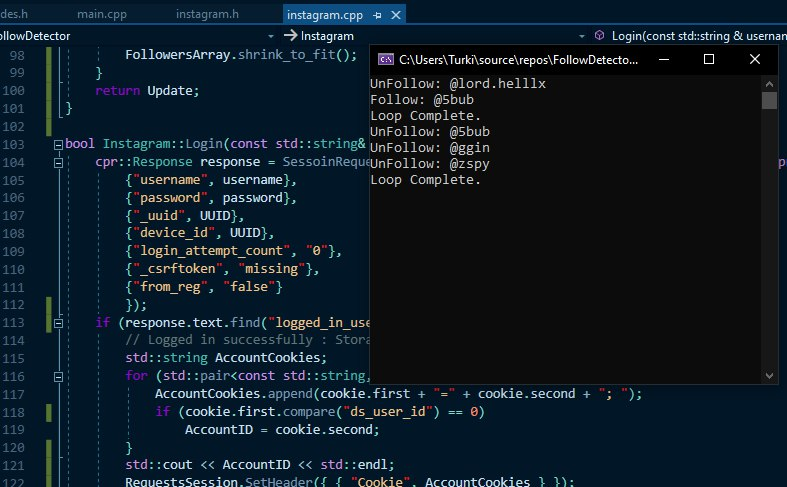

# FollowDetector
A script to check the ones who followed/unfolllowed you in instagram, using Instagram APis.

# Requirements
a C++11 or above compatible compiler such as Clang or GCC.

[C++ Requests: Curl for People](https://github.com/whoshuu/cpr)

[JSON for Modern C++](https://github.com/nlohmann/json)

# TODO
*Speed up scraping of the users. Right now scraping is quite slow and can be improved.*

